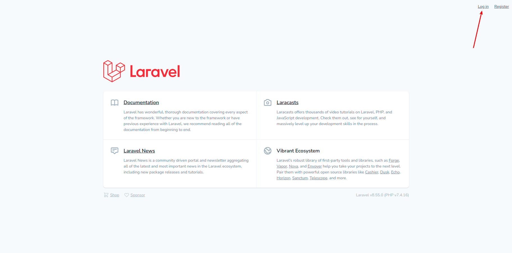
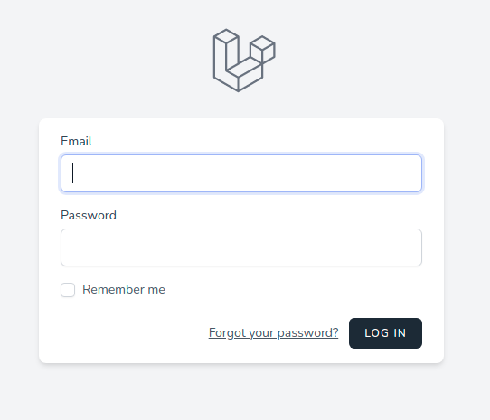
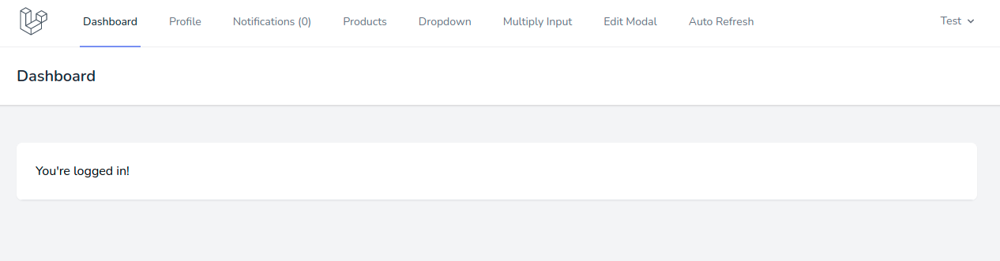

# Аутентификация

Ссылка на аутентификацию (*login*) расположена в шапке приложения:

По клику открывается отдельная страница с формой:

После успешной аутентификации пользователь будет переадресован на стартовую страницу приложения:

---

Следующее: [Изменение данных профиля](../06-profile/README.md)
