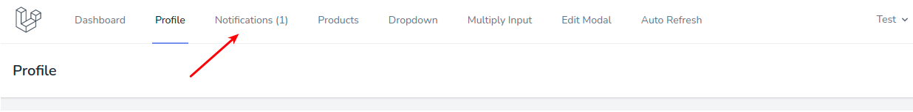

# Изменение данных профиля

Страница изменения профиля находится в пункте меню **Profile**:

В левой части можно изменить основные данные пользователя - **имя** и **email**:

В правой части меняется **пароль** пользователя:

В обеих формах работает **мгновенная валидация**, сразу при вводе данных в поля:

При успешном изменении в форме отображается соответствующее **сообщение**:

А в главном меню изменяется **счетчик изменений**:

---

Следующее: [Управление товарами](../07-products/README.md)
