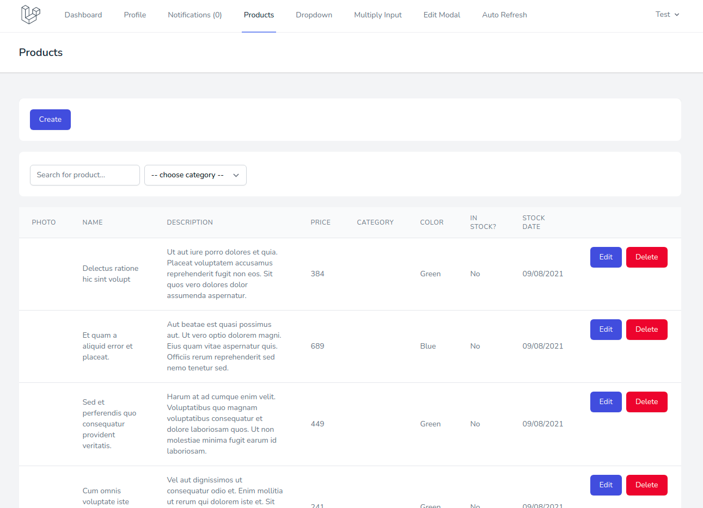

# Управление товарами

Страница управления товарами находится в пункте меню **Products**:

Здесь отображается список всех товаров с учетом пагинации:

Товары можно фильтровать по наименованию и категории:

Кнопка **Create** позволяет создать новый товар:

Кнопка **Edit** напротив каждого товара позволяет отредактировать его данные:

Кнопка **Delete** напротив каждого товара позволяет (после подтверждения) его удалить:

---

Следующее: [Взаимосвязанные выпадающие списки](../08-dropdown/README.md)
