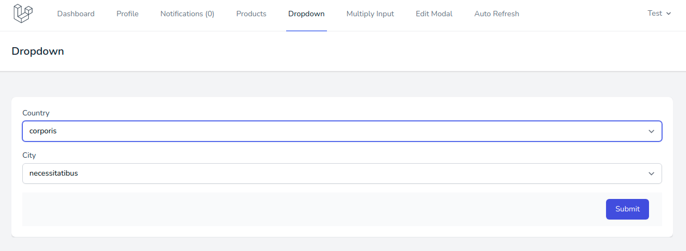
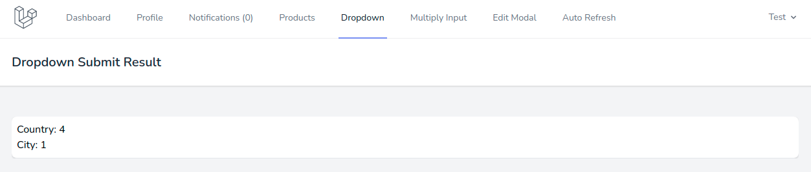

# Взаимосвязанные выпадающие списки

Пример взаимосвязанных выпадающих списков находится в пункте меню **Dropdown**:

Здесь при выборе значения в списке **Country** становится доступен для выбора список в поле **City**, первый элемент из этого списка автоматически становится выбранным:

При отправке формы отображаются выбранные в ней значения:

---

Следующее: [Форма с множественными однотипными полями](../09-multiply-input/README.md)
