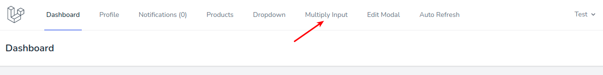
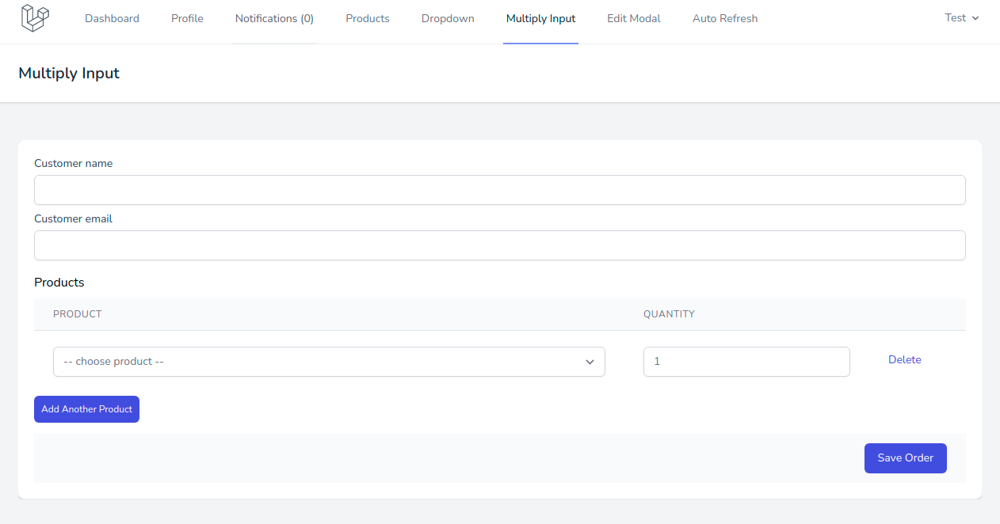
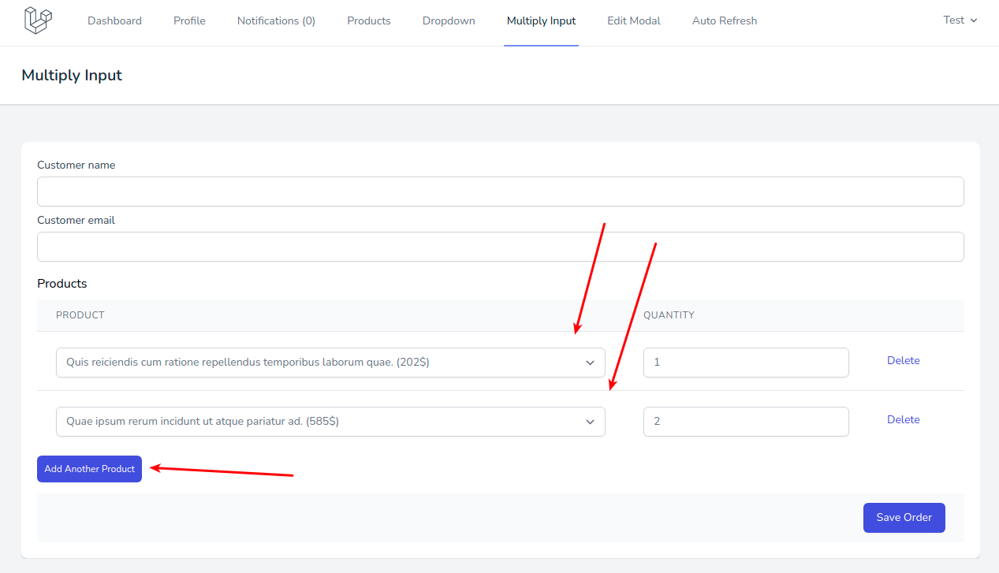
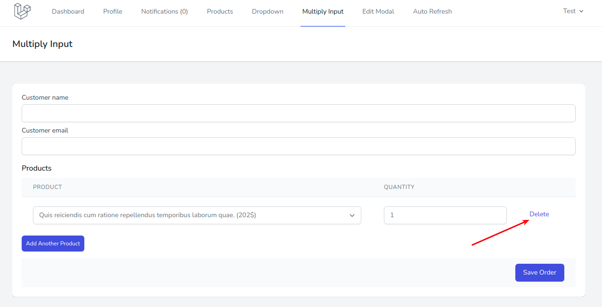
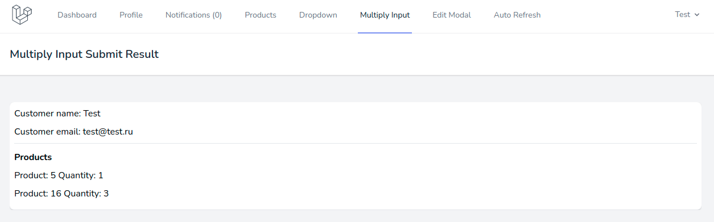

# Форма с множественными однотипными полями

Форма с множественными однотипными полями находится в пункте меню **Multiply Input**:

Здесь расположена форма оформления заказа с базовыми для этого процесса полями:

Важная особенность - в качестве списка товаров можно указывать несколько позиций и их количество:

А также удалять лишние, если это необходимо:

При отправке формы отображаются выбранные в ней значения:

---

Следующее: [Редактирование товаров в модальном окне](../10-edit-modal/README.md)
