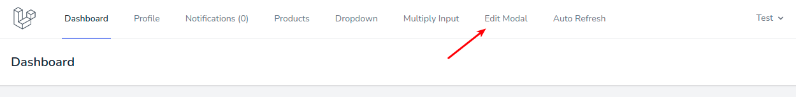

# Редактирование товаров в модальном окне

Функционал редактирования товаров в модальном окне находится в пункте меню **Edit Modal**:

Здесь расположен список всех товаров с указанием цены:

Кнопка **Edit** напротив каждого товара вызывает окно редактирования данных этого товара:

В форме работает **мгновенная валидация**, сразу при вводе данных в поля:

После сохранения данные товара сразу изменяются в списке.

---

Следующее: [Автоперезагрузка содержимого страницы](../11-auto-refresh/README.md)
